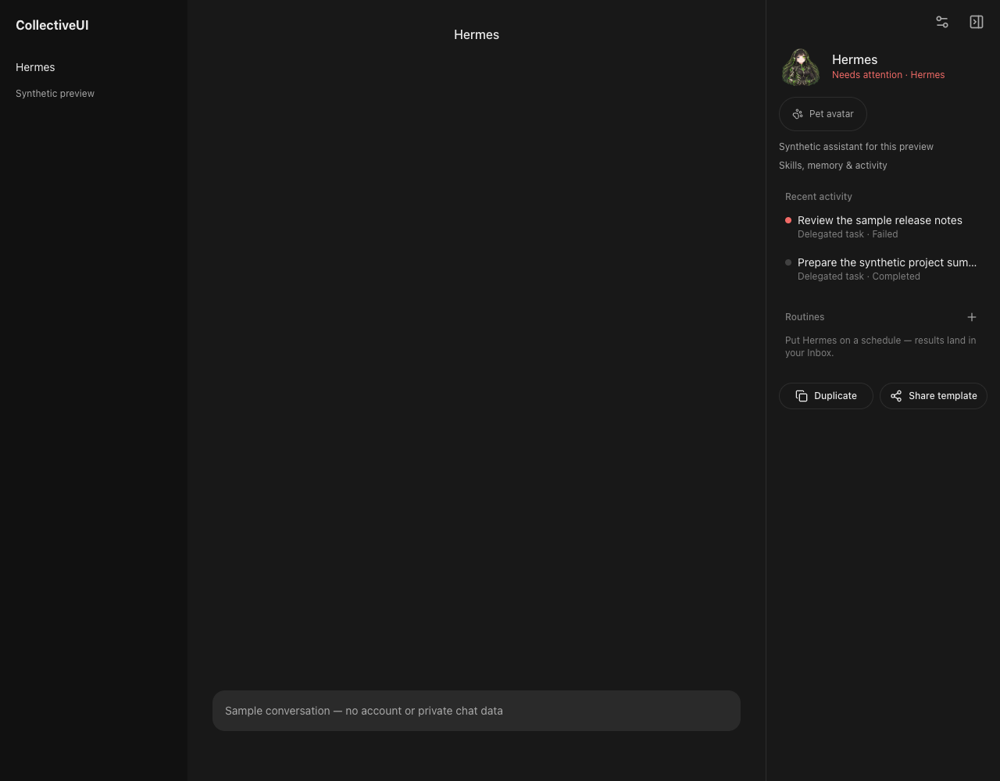
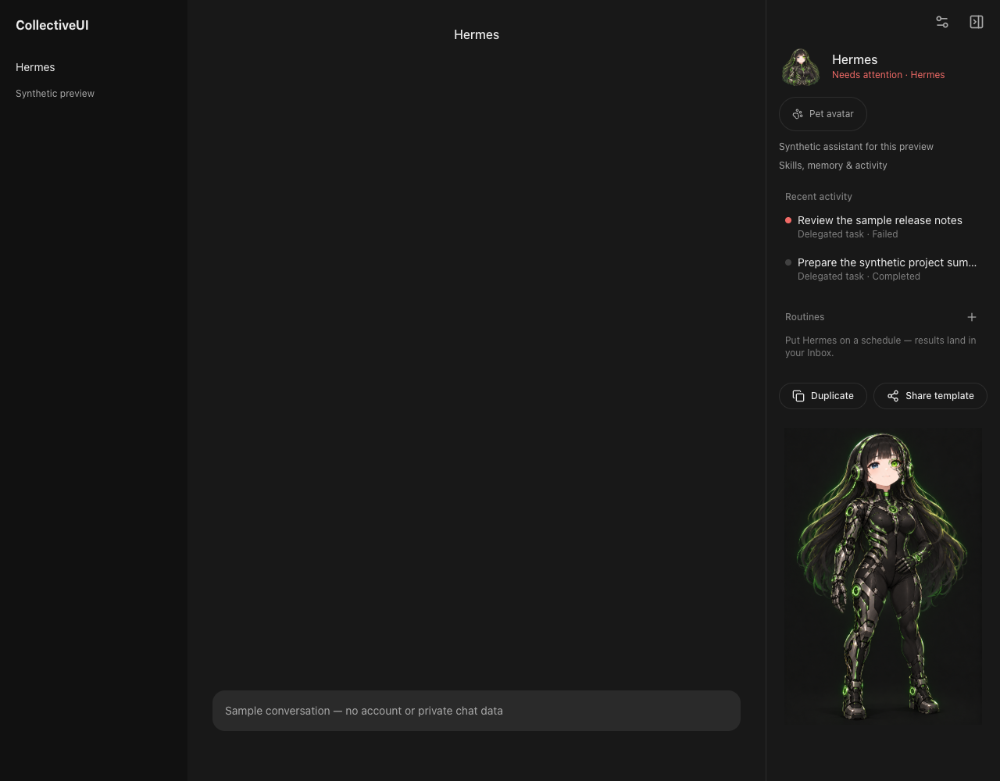
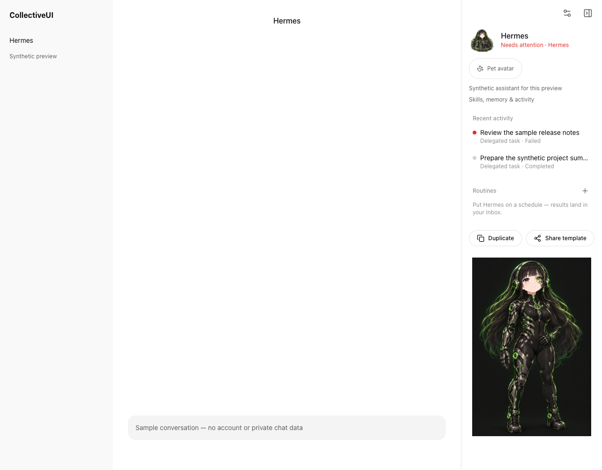

# Full-body Hermes sidebar portrait

These captures render the production web sidebar and its controls with synthetic bot/activity data. No user accounts, private conversations or supplied context screenshots are included. The surrounding chat/navigation surface is a synthetic fixture.

| Before (dark) | After (dark) | After (light) |
| --- | --- | --- |
|  |  |  |

[240px panel](narrow-240.png) · [480px-high busy panel, scrolled to controls and portrait](short-busy.png)

The supplied portrait is reproduced under its [artwork notice](../../../public/portraits/README.md), outside the application's MIT license.

Regenerate: `BOT_PORTRAIT_SCREENSHOTS=/tmp/hermes-portrait node tests/browser/bot-sidebar-portrait.mjs`. CI saves the same synthetic after captures as `bot-portrait-screenshots`.
